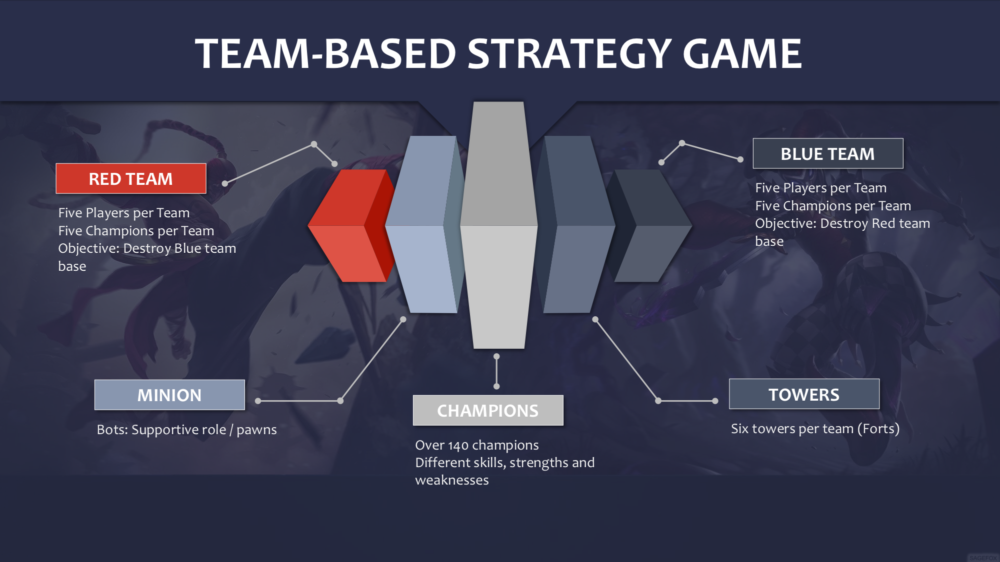
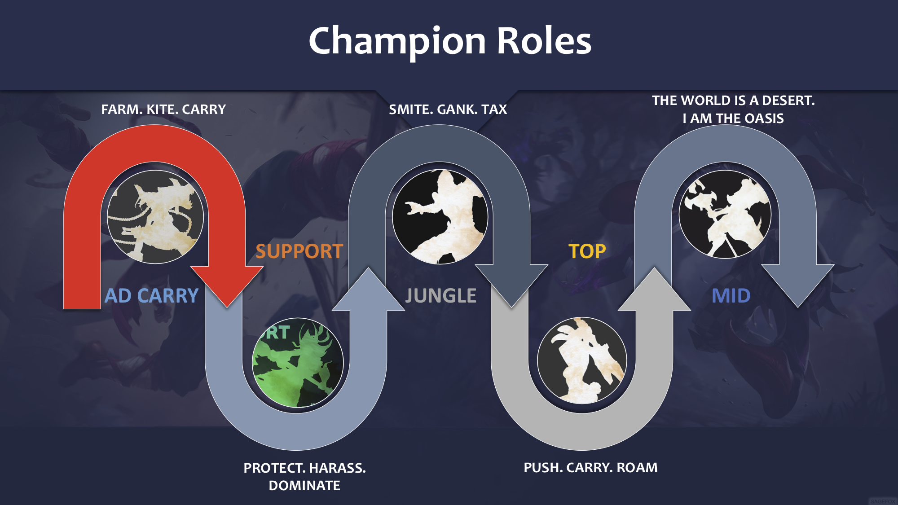
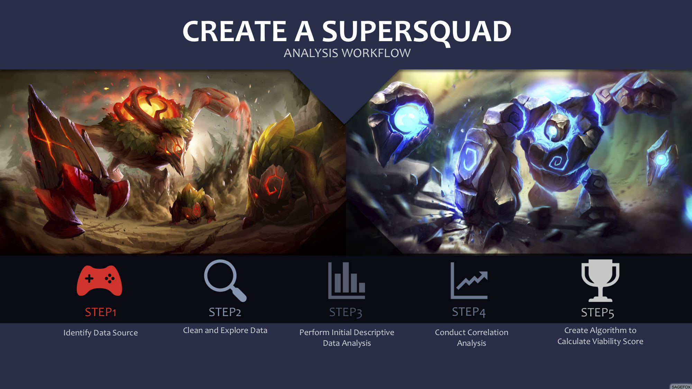
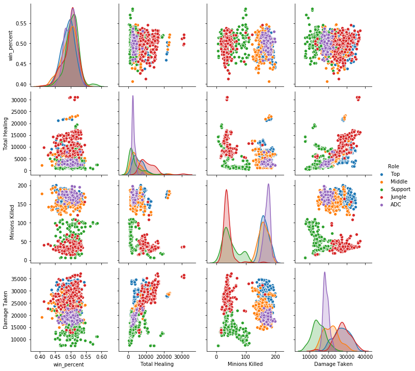
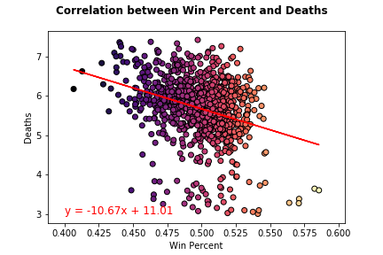
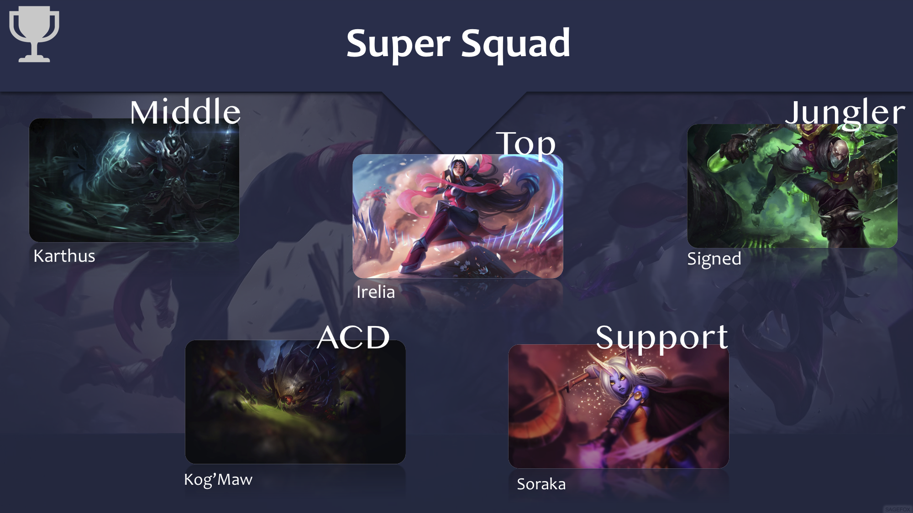

# League of Legends

### Objective: Analyze player data for the game League of Legends to create a "Super Squad" team of Champions

_Data Sources: Champion.gg & GamesofLegends eSports_

### Dependencies

- Numpy
- Pandas
- Seaborn
- Scipy
- Matplotlib

# Game Overview
League of Legends is a 2009 multiplayer online battle arena video game developed and published by Riot Games

Players select from 140 _Champions_ to battle in the game. Champions are divided into 5 different roles with various skills, strengths and weaknesses

1. Ad Carry
2. Support
3. Jungle
4. Top
5. Mid

# Work Flow

## Identify & Clean Data Sets
Use pandas to create a dataframe, remove rows with null values, and manipulate data set to calculate
1. Win Percent
2. Play Percent
3. Ban Rate

## Descriptive Data Analysis

1. Based on our knowledge of the game we were able to identify the key traits/metrics for each role
    - Healing power
    - Damage 
    - Kills
    - Deaths
    - Kill Assists
2. Create new pandas dataframe for each role, calculate mean, then sort.
3. Use matplotlib and graph top 10 Champions per metric

## Correlation Analysis

Pairplot analysis of all metrics to visualize correlations and distribution of the data

Regression analysis between win perentage and deaths

## Create Algorithm to Calculate a Viability Score

Created role-specific algorithms to determine top champion for each role. Equation takes into account the most import metrics and uses them to create an overal viability score. 

